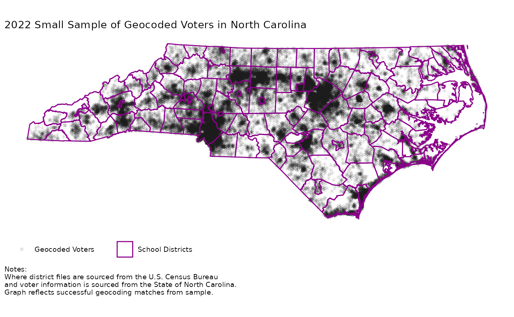

# Getting Started

The following brief tutorial demonstrates how to use the three main
functions in the QOR package:
[`query()`](https://adam-p-shepardson.github.io/QOR/reference/query.md),
[`overlay()`](https://adam-p-shepardson.github.io/QOR/reference/overlay.md),
and
[`recover()`](https://adam-p-shepardson.github.io/QOR/reference/recover.md).
This example uses an anonymized sample of voter addresses as well as
school district, state, and zip code shapefiles from North Carolina.

## Load Package and Data

``` r
# You would need your local path below to run the setup examples:
local_path <- here::here()  # Change this to your local path

# Packages for example
library(tidyverse)
library(sf)
library(QOR)

# Load example voter addresses
example <- haven::read_dta(system.file("example_data", "sample_2022_addresses.dta", package = "QOR"))

# Load shapefiles (see Data Setup vignette for download instructions)
state_shape <- read_sf(dsn = paste0(local_path, "data-raw/Extracted/North_Carolina_State_Boundary")) %>%
  dplyr::summarize(geometry = st_union(geometry)) %>%
  st_make_valid()
zip_shape <- sf::read_sf(dsn = paste0(local_path, "data-raw/Extracted/ZIP_2022")) %>%
  st_make_valid()
district_shape <- sf::read_sf(dsn = paste0(local_path, "data-raw/Extracted/SCHOOL_SY2022")) %>%
  st_make_valid()
```

## Query: Geocode Addresses

The first step is to geocode unit addresses using the
[`query()`](https://adam-p-shepardson.github.io/QOR/reference/query.md)
function. This function takes a data frame of addresses and returns two
data frames: one with successfully geocoded points and another with
addresses that could not be geocoded.

``` r
test_query <- query(
  units = example,
  unit_id = "statevoterid",
  street = "street",
  city = "city",
  state = "state",
  state_shape = state_shape,
  units_per_batch = 4000, # note: up to 10,000 for Census geocoder, but connection issues can arise with large batches
  method = "census",
  sleep_time = 2,
  year = 2022,
  unit_zip = "postalcode",
  max_tries = 15
)
#> Runtime: Query Full Time: 1862.547 sec elapsed

matched <- test_query[[1]]    # Successfully geocoded (use for Overlay)
unmatched <- test_query[[2]]  # Failed to geocode (use for Recover)
```

We can demonstrate that the geocoding worked by plotting the matched
points against the state boundary and district shapes:

``` r
# Packages for plotting
library(ggplot2)
library(ggthemes)

# Filter down to just NC districts
district_shape_temp <- district_shape %>% filter(STATEFP == 37) # NC is FIPS 37

# Plot geocoded points
plot <- ggplot() +
    geom_sf(data = state_shape, alpha = 0) +
    geom_sf(data = matched, pch = "*", size = 3, alpha = 0.2, aes(color = "Geocoded Voters")) +
    geom_sf(data = district_shape_temp, alpha = 0.1, color = "darkmagenta", size = 0.5, aes(fill = "School Districts")) +
    scale_color_manual(values = "black") +
    scale_fill_manual(values = "white") +
    labs(title = paste0(as.character(2022), " Small Sample of Geocoded Voters in North Carolina"),
         caption = "Notes: \nWhere district files are sourced from the U.S. Census Bureau \nand voter information is sourced from the State of North Carolina. \nGraph reflects successful geocoding matches from sample.",
         fill = "", color = "") +
    ggthemes::theme_map() +
    theme(legend.position = "bottom", legend.direction = "horizontal", plot.caption = element_text(hjust = 0),
          panel.background = element_rect(fill = "white", color = "white"), plot.background = element_rect(fill = "white", color = "white"))

rm(district_shape_temp)

print(plot) # display map
```



## Overlay: Match Voters to Districts

The second step is to overlay the geocoded points onto the district
shapefiles using the
[`overlay()`](https://adam-p-shepardson.github.io/QOR/reference/overlay.md)
function. This function assigns each geocoded point to a polygon (school
district) based on spatial location.

``` r
test_overlay <- overlay(
  points = matched,
  polygons = district_shape,
  point_id = "statevoterid",
  polygon_id = "GEOID",
  used_NCES = TRUE,
  FIPS_code = "37",
  FIPS_col = "STATEFP"
)
```

## Recover: Assign Unmatched Voters

The final step is to recover the unmatched units using the
[`recover()`](https://adam-p-shepardson.github.io/QOR/reference/recover.md)
function. This function uses zip code information and spatial distances
between zip code and polygon centers to assign unmatched units to
polygons.

``` r
test_recover <- recover(
  units = unmatched,
  polygons = district_shape,
  zipcodes = zip_shape,
  unit_id = "statevoterid",
  unit_zip = "postalcode",
  polygon_id = "GEOID",
  zip_id = "ZCTA5CE20",
  state_shape = state_shape,
  used_NCES = TRUE,
  FIPS_code = "37",
  FIPS_col = "STATEFP"
)

matched_byzip <- test_recover[[1]]    # Successfully matched to a district by zipcode
no_zip <- test_query[[2]]  # Failed to map unit zip code to a Census-recognized zip code for that year
```

## Why Does This Work?

QOR leverages the fact that voters, school districts, and zip codes are
all spatial entities convertable to the same coordinate reference system
(CRS). The visualization below shows, conceptually, the three different
layers.

Geocoded voter points from
[`query()`](https://adam-p-shepardson.github.io/QOR/reference/query.md)
can be overlaid onto school district polygons used in
[`overlay()`](https://adam-p-shepardson.github.io/QOR/reference/overlay.md)
to identify which voters live in which districts. For unmatched voters,
QOR uses zip code polygons in
[`recover()`](https://adam-p-shepardson.github.io/QOR/reference/recover.md)
as an intermediary spatial unit to help assign voters to districts based
on proximity.

Note: The 3D plot above is interactive! Feel free to rotate and zoom to
explore the layers. We only load about 70% of districts and zipcodes at
random to reduce browser memory burden. Simulated “voter” points are
also randomly distributed without regard to population densities.
